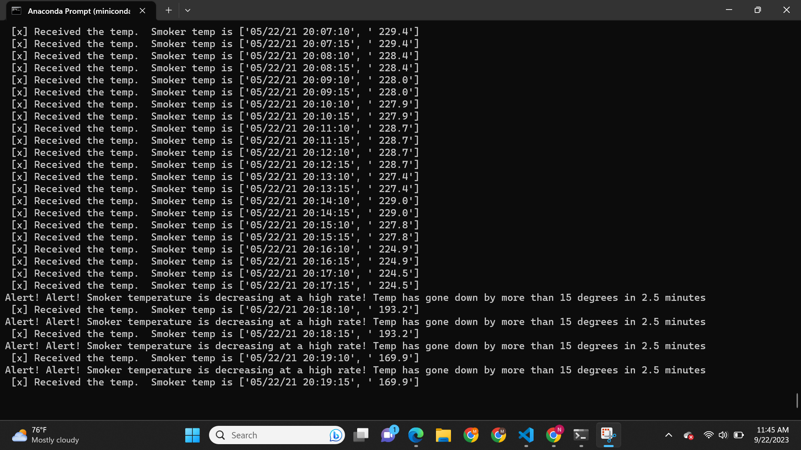
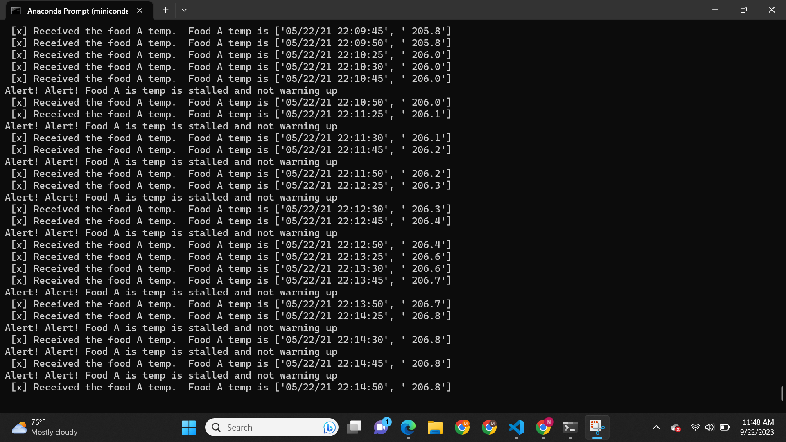
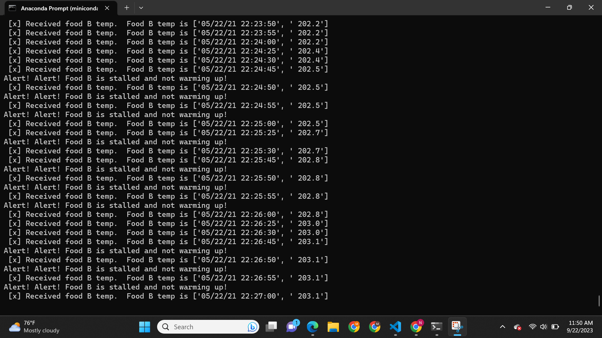
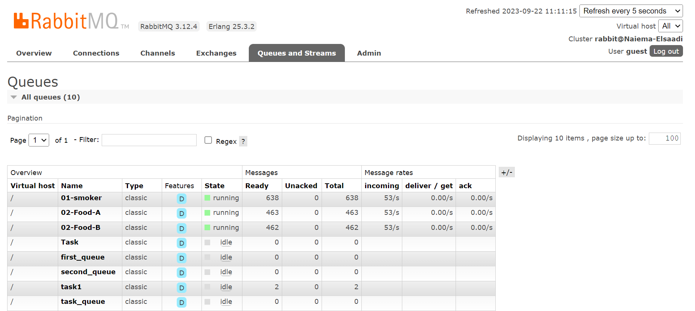
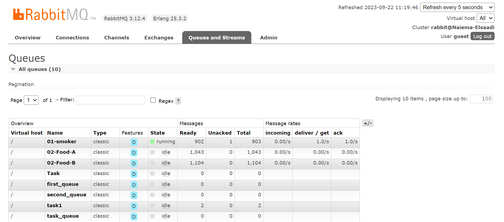
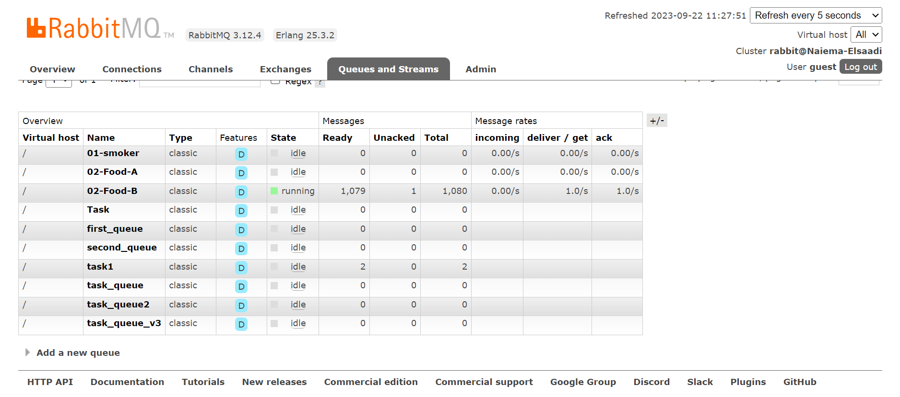

# streaming-06-smart-smoker-consumers
 In this project, we'll add consumers, implement analytics based on a rolling window of time, and raise an alert when interesting events are detected. 

 Author: Naiema Elsaadi
 Date: September 22, 2023

## Table of Contents

- [Overview](#overview)
- [Prerequisites](#prerequisites)
- [How to Run](#how-to-run)
- [Project Structure](#project-structure)
- [How It Works](#how-it-works)
- [Screenshots](#screenshots)
- [RabbitMQ Console](#rabbitmq-console)

## Overview

The Smart Smoker Temperature Monitoring System is a project designed to monitor and analyze temperature data from a smoker and food items in a slow-cooking environment. The system consists of a producer that collects temperature data and sends it to RabbitMQ message queues, and multiple consumers that process the data, perform analytics, and raise alerts for specific temperature conditions.

## Prerequisites

Before running the project, ensure you have the following prerequisites:

- Git
- RabbitMQ server running
- Python 3.10+ installed
- VS studio Code
- anaconda prompt (miniconda3)
- The following modules are used in this project:
 csv
 webbrowser
 signal
 sys
 time
 pika 
 socket
 deque
- Required Python libraries (e.g., pika) installed in your active environment

## How to Run

Follow these steps to run the project:

1. Clone the repository to your local machine:
2. Navigate to the project directory:
3. Start the producer to collect temperature data:
4. Open separate terminal windows and start the consumers for smoker temperature and food temperatures:
 Smoker Temperature Consumer:python 01-smoker_listener.py
 Food A Temperature Consumer:python 02-Food-A_listener.py
 Food B Temperature Consumer:python 02-Food-B_listener.py

## Project Structure

The project structure is organized as follows:
 streaming-05-getting-started/
  bbq_producer_smoker.py
  01-smoker_listener.py
  02-Food-A_listener.py
  02-Food-B_listener.py
  smoker-temps.csv
  Screenshots for running 

## How It Works

The producer (bbq_producer_smoker.py) collects temperature data from sensors and sends it to RabbitMQ message queues.
 Three consumers (01-smoker_listener.py, 02-Food-A_listener.py, 02-Food-B_listener.py)  listen to their respective message queues.
 Each consumer maintains a rolling window of temperature data, calculates analytics, and raises alerts based on predefined conditions.

## Screenshots

## Producer and Consumers
 Here is a screenshots of the multiple terminals with the three consumers.

## RabbitMQ Console

 Here is a screenshot of the RabbitMQ console with the producer and consumers running, showing message queues and message traffic:

## Reference

<b> https://www.rabbitmq.com/tutorials/tutorial-two-python.html

  https://github.com/denisecase/streaming-04-multiple-consumers/blob/main/v2_listening_worker.py

